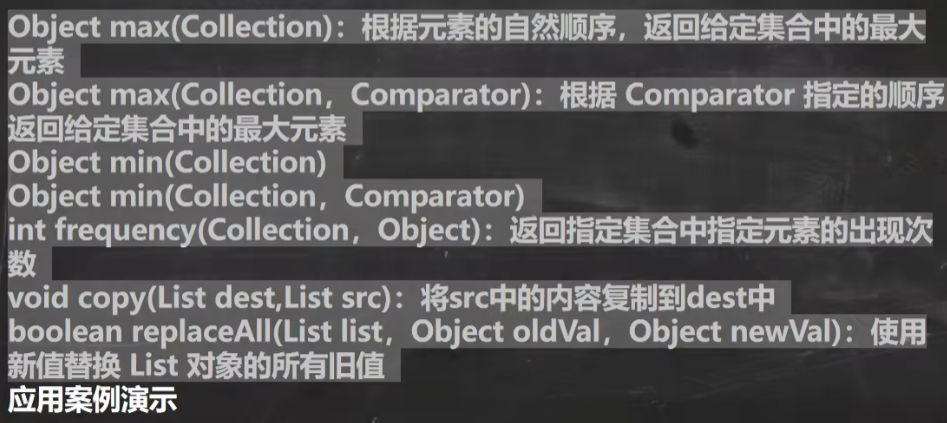
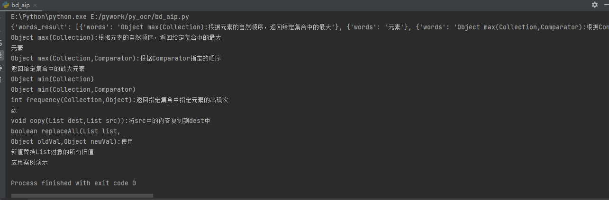

原始截图：

识别后结果：
```text
E:\Python\python.exe E:/pywork/py_ocr/bd_aip.py 
{'words_result': [{'words': 'Object max(Collection):根据元素的自然顺序，返回给定集合中的最大'}, {'words': '元素'}, {'words': 'Object max(Collection,Comparator):根据Comparator指定的顺序'}, {'words': '返回给定集合中的最大元素'}, {'words': 'Object min(Collection)'}, {'words': 'Object min(Collection,Comparator)'}, {'words': 'int frequency(Collection,Object):返回指定集合中指定元素的出现次'}, {'words': '数'}, {'words': 'void copy(List dest,List src)):将src中的内容复制到dest中'}, {'words': 'boolean replaceAll(List list,'}, {'words': 'Object oldVal,Object newVal):使用'}, {'words': '新值替换List对象的所有旧值'}, {'words': '应用案例演示'}], 'words_result_num': 13, 'log_id': 1562496184076809743}
Object max(Collection):根据元素的自然顺序，返回给定集合中的最大元素
Object max(Collection,Comparator):根据Comparator指定的顺序返回给定集合中的最大元素
Object min(Collection)
Object min(Collection,Comparator)
int frequency(Collection,Object):返回指定集合中指定元素的出现次数
void copy(List dest,List src)):将src中的内容复制到dest中
boolean replaceAll(List list,
Object oldVal,Object newVal):使用新值替换List对象的所有旧值

应用案例演示

=========================分割线=========================

调整下格式：
E:\Python\python.exe E:/pywork/py_ocr/bd_aip.py 
{'words_result': [{'words': 'Object max(Collection):根据元素的自然顺序，返回给定集合中的最大'}, {'words': '元素'}, {'words': 'Object max(Collection,Comparator):根据Comparator指定的顺序'}, {'words': '返回给定集合中的最大元素'}, {'words': 'Object min(Collection)'}, {'words': 'Object min(Collection,Comparator)'}, {'words': 'int frequency(Collection,Object):返回指定集合中指定元素的出现次'}, {'words': '数'}, {'words': 'void copy(List dest,List src)):将src中的内容复制到dest中'}, {'words': 'boolean replaceAll(List list,'}, {'words': 'Object oldVal,Object newVal):使用'}, {'words': '新值替换List对象的所有旧值'}, {'words': '应用案例演示'}], 'words_result_num': 13, 'log_id': 1562496184076809743}
 
1.Object max(Collection):根据元素的自然顺序，返回给定集合中的最大元素
2.Object max(Collection,Comparator):根据Comparator指定的顺序,返回给定集合中的最大元素
3.Object min(Collection)
4.Object min(Collection,Comparator)
5.int frequency(Collection,Object):返回指定集合中指定元素的出现次数
6.void copy(List dest,List src)):将src中的内容复制到dest中
7.boolean replaceAll(List list,Object oldVal,Object newVal):使用新值替换List对象的所有旧值
8.应用案例演示
```
---
